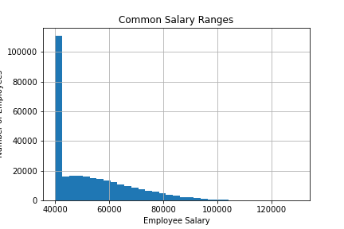
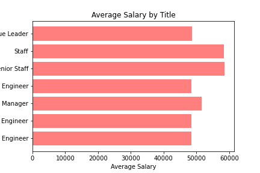

NOTE: ignore the '**EmployeeSQL**' folder with the special characters, I am having some trouble removing it.  Everything needed is in the EmployeeSQL folder.
# sql-challenge
The purpose of this project is to analyze employee data from fictitious company Pewlett Hackard.  The employee data files are from 1980's and 1990's, and only available in csv format.

As a first step in data engineering, I explored the datasets and built out an .
As this was my first time using a free ERD software, I did have to make some adjustments after the initial model was formed.

There are six tables within the dataset.  These include:
        employees: data about each employee
        titles: all the valid titles used within the company and a title number
        departments: all valid department names and the department number
        salaries: the employee number and the salary
        dept_manager: for each department, the employee number of the manager(s)
        dept_emp: the department number that each employee (number) is in

Once I had a basic understanding of the data elements and relationships between tables, I proceeded to create the SQL database. Using pgadmin, I created the PH_employees database
with a table for each of the csv files. There were 6 tables in all.  The code for creating the table structures and loading the data is in the table_schemata.sql file.

I then created queries to present data for the below scenarios.  These queries are captured in the sql_queries.sql file.
1. List the following details of each employee: employee number, last name, first name, sex, and salary.

2. List first name, last name, and hire date for employees who were hired in 1986.

3. List the manager of each department with the following information: department number, department name, the manager's employee number, last name, first name.

4. List the department of each employee with the following information: employee number, last name, first name, and department name.

5. List first name, last name, and sex for employees whose first name is "Hercules" and last names begin with "B."

6. List all employees in the Sales department, including their employee number, last name, first name, and department name.

7. List all employees in the Sales and Development departments, including their employee number, last name, first name, and department name.

8. In descending order, list the frequency count of employee last names, i.e., how many employees share each last name.

At this point I was starting to think that my boss was pulling my chain and that this was not real employee data, so I imported the database into pandas where I could perform some additional analysis.

I created a histogram of salaries to see what salaries looked like back in the 80's and 90's.  The output is saved to the Salary Ranges file.

 

Wow, people did not make a lot back in the 80's.

Next I computed the average salary per job title and graphed this in Average Salary

 

Most people working for PH were making between 48 - 60K.  

I showed the analysis to my boss and he was only marginally impressed but he had a smirk on his face.  As I was leaving his office he muttered, look at your data.  I looked at my badge, found my employee number 499942, and queried this in the database.  HaHa HaHa - jokes on me.  My name is "April Fools"!!

